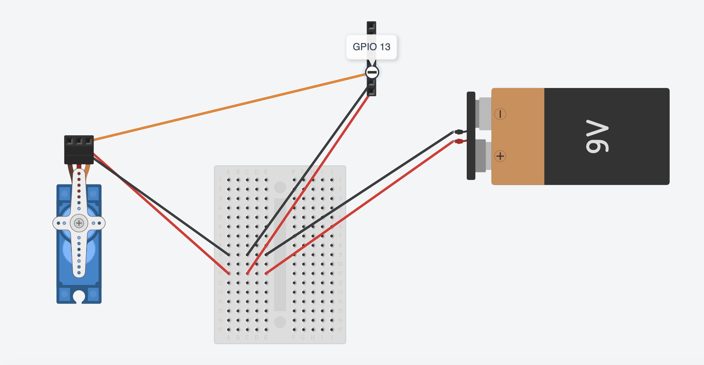

# Spray Servo

Upload the code from the spray-servo.ino file to an ESP-32 board and enjoy !

<h3>The code includes :</h3>
<ul>
<li>A simple webpage to control the servo</li>
<li>Soft Access point to access the webpage</li>
<li>The servo control</li>
</ul>

<h3>Default access point credentials</h3>
<ul>
<li><b>ssid:</b> spray-servo </li>
<li><b>password:</b> 12345678 </li>
</ul>

<h3>3D Printed Parts</h3>
Inside the <a href="./STL%20Files">STL Files</a> folder you will find all the necessary parts to print.
Those parts are designed by <a href="https://www.thingiverse.com/aliekens/designs">Alikens</a> and this is the <a href="https://www.thingiverse.com/thing:4622176">original parts page</a>.

<h3>Connections</h3>

<ul>
  <li>Connect the Signal Yellow/White cable of the servo on the GPIO 13 of the ESP-32 board.</li>
  <li>Connect the Power Red cable of the servo with the one from the battery and the VIN Pin of the ESP-32 board which will also be powered by the battery.</li>
  <li>Connect the Ground Black cable of the servo with the one from the battery and the GND Pin of the ESP-32 board.</li>
</ul>
